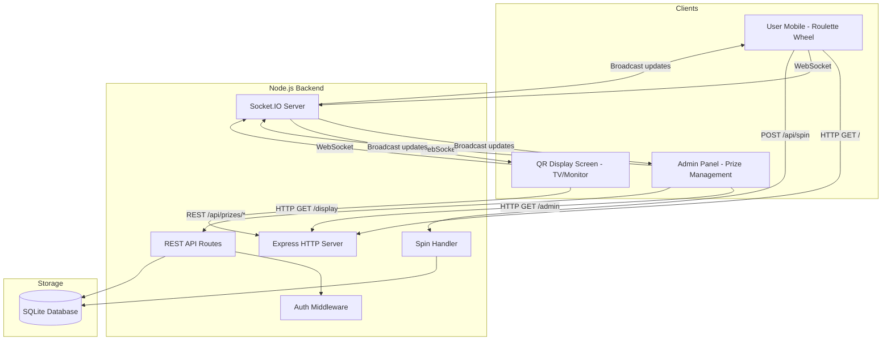
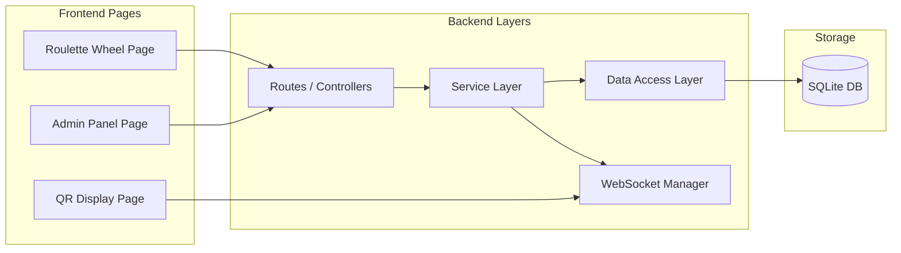
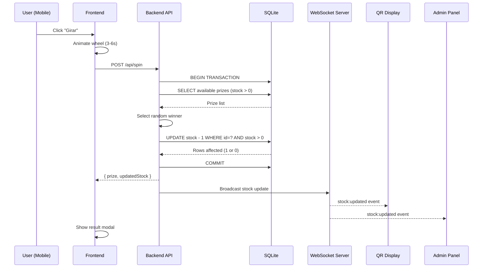
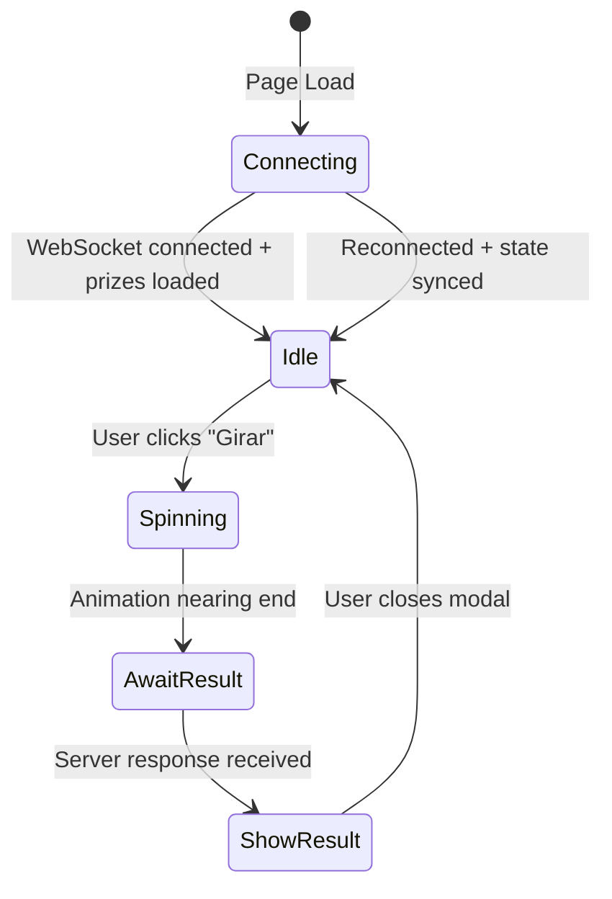
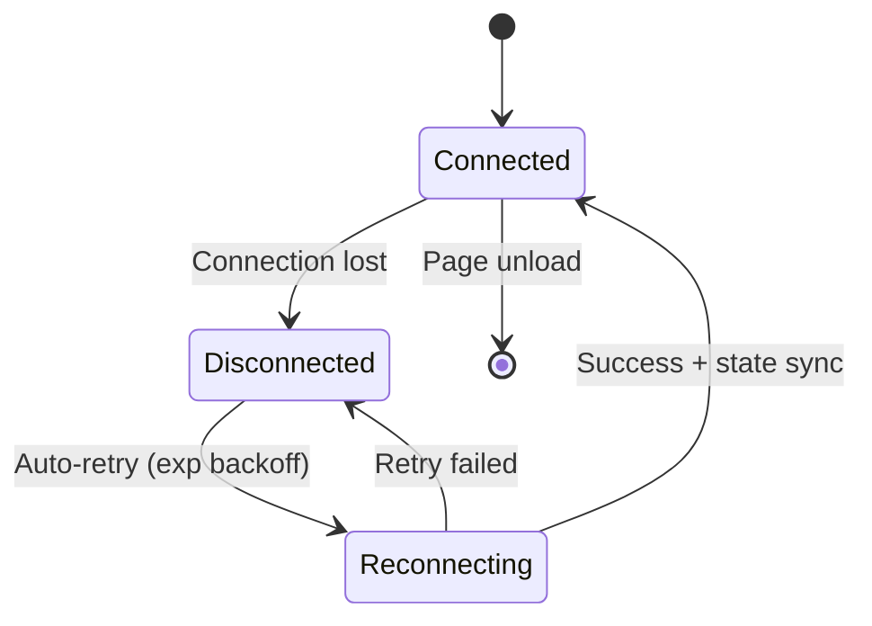

# Technical Design Document: Prize Roulette Wheel

## Overview

This document describes the technical design for a web-based prize roulette wheel application with real-time stock management, an admin panel, and a QR display screen. Users access the app by scanning a QR code on mobile devices, interact with an animated spinning wheel, and receive a prize outcome. Event organizers manage prizes via a password-protected admin panel, while a dedicated display screen shows available prizes to attendees in real time.

The application consists of:
- **Frontend (User-facing)**: Vanilla HTML/CSS/JS single-page app with Canvas-rendered wheel
- **Frontend (Admin Panel)**: Password-protected CRUD interface for prize management
- **Frontend (QR Display Screen)**: Large-screen display showing QR code and live prize list
- **Backend**: Node.js/Express server with WebSocket support, REST API, and SQLite persistence

### Key Design Decisions

| Decision | Choice | Rationale |
|----------|--------|-----------|
| Wheel Rendering | HTML5 Canvas | Efficient for drawing pie-chart segments; single bitmap avoids DOM complexity |
| Spin Animation | CSS `transform: rotate()` with `transition` | GPU-accelerated rotation, smooth 60fps |
| Easing | `cubic-bezier(0.17, 0.67, 0.12, 0.99)` | Mimics physical wheel deceleration |
| Frontend Framework | Vanilla JS (no framework) | Application scope per page is small; avoids bundle complexity |
| Backend Runtime | Node.js + Express | Lightweight, same language as frontend, excellent WebSocket support |
| Real-Time | Socket.IO | Built-in reconnection, room support, fallback transports |
| Data Store | SQLite (via better-sqlite3) | Zero-config, file-based, supports concurrent reads, sufficient for event scale |
| Concurrency Control | SQLite WAL mode + transactions | Prevents stock over-decrement with serialized writes |
| Auth | Simple password (env variable) | Event-scoped; no user accounts needed |
| Responsive | CSS viewport units + media queries | Natural scaling across device sizes |


### Research Summary

- **Canvas vs SVG for wheel rendering**: For wheels with 4-12 segments, Canvas provides better animation performance because the wheel is drawn once as a bitmap and rotated via CSS transforms. SVG would require rotating individual DOM elements.
- **Spin animation approach**: Applying CSS `transition` on `transform: rotate(Xdeg)` leverages GPU compositing for smooth animation without JavaScript frame loops. The target rotation is calculated as `(randomFullRotations * 360) + targetSegmentAngle`.
- **Socket.IO for real-time**: Socket.IO provides automatic reconnection with exponential backoff, room-based broadcasting, and transparent fallback to long-polling when WebSocket is unavailable. This is critical for the QR display screen and admin panel staying synchronized. ([Source](https://socket.io/docs/v4/))
- **SQLite for event-scale persistence**: SQLite in WAL (Write-Ahead Logging) mode handles concurrent reads efficiently while serializing writes through a single writer lock — perfect for preventing stock over-decrement. better-sqlite3 provides synchronous API that simplifies transaction handling. ([Source](https://github.com/WiseLibs/better-sqlite3))
- **Concurrency control pattern**: Using `UPDATE prizes SET stock = stock - 1 WHERE id = ? AND stock > 0` in a single atomic SQL statement prevents race conditions without explicit locking. The affected row count tells us if the decrement succeeded.

---

## Architecture





### Application Layers



### Request Flow: User Spin




### State Machine (User-Facing App)



| State | Spin Button | Wheel | Modal | WebSocket |
|-------|-------------|-------|-------|-----------|
| Connecting | Disabled | Loading | Hidden | Connecting |
| Idle | Enabled ("Girar") | Static, shows current prizes | Hidden | Connected |
| Spinning | Disabled | Rotating with easing | Hidden | Connected |
| AwaitResult | Disabled | Decelerating | Hidden | Connected |
| ShowResult | Disabled | Static (at winning angle) | Visible | Connected |

### URL Routes

| Route | Page | Description |
|-------|------|-------------|
| `/` | Roulette Wheel | User-facing spinning wheel |
| `/admin` | Admin Panel | Password-protected prize management |
| `/display` | QR Display Screen | TV/monitor display with QR + prize list |
| `/api/prizes` | REST API | CRUD endpoints for prizes |
| `/api/spin` | REST API | Spin endpoint |

---

## Components and Interfaces


### Backend Components

#### 1. Express Server (`server.js`)

Entry point that wires up HTTP routes, Socket.IO, and static file serving.

```typescript
interface ServerConfig {
  port: number;
  adminPassword: string;
  dbPath: string;
  webAppUrl: string;  // URL encoded in QR code
}
```

**Responsibilities:**
- Serve static HTML/CSS/JS for all three frontend pages
- Mount REST API routes under `/api`
- Initialize Socket.IO server
- Initialize SQLite database on startup

#### 2. Prize Service (`services/prizeService.js`)

Core business logic for prize management and stock operations.

```typescript
interface PrizeService {
  getAllPrizes(): Prize[];
  getPrizeById(id: string): Prize | null;
  createPrize(data: CreatePrizeInput): Prize;
  updatePrize(id: string, data: UpdatePrizeInput): Prize;
  deletePrize(id: string): boolean;
  decrementStock(prizeId: string): DecrementResult;
  getAvailablePrizes(): Prize[];  // stock > 0
}

interface DecrementResult {
  success: boolean;      // false if stock was already 0
  prize: Prize | null;
  newStock: number;
}
```

**Responsibilities:**
- CRUD operations on prizes with validation
- Atomic stock decrement with concurrency safety
- Query available prizes (stock > 0) for wheel display


#### 3. Spin Service (`services/spinService.js`)

Handles spin logic: random selection and stock decrement.

```typescript
interface SpinService {
  executeSpin(): SpinResult;
}

interface SpinResult {
  outcome: 'prize' | 'no_prize';
  prize?: Prize;
  segmentIndex: number;
  updatedPrizes: Prize[];  // Full list for client sync
}
```

**Responsibilities:**
- Build active wheel segments from current prize data (replace stock=0 with "Sin Premio")
- Select random winning segment
- If winner is a prize, attempt atomic stock decrement
- If decrement fails (race condition), fall back to "Sin Premio" outcome
- Return full updated prize list for broadcast

#### 4. WebSocket Manager (`services/wsManager.js`)

Manages Socket.IO connections and event broadcasting.

```typescript
interface WebSocketManager {
  initialize(io: SocketIOServer): void;
  broadcastStockUpdate(prizes: Prize[]): void;
  broadcastPrizeListUpdate(prizes: Prize[]): void;
  sendInitialState(socket: Socket): void;
}
```

**WebSocket Events:**

| Event | Direction | Payload | Description |
|-------|-----------|---------|-------------|
| `connection` | Client → Server | — | Client connects |
| `prizes:initial` | Server → Client | `Prize[]` | Full prize list on connect/reconnect |
| `prizes:updated` | Server → Client | `Prize[]` | Full prize list after any change |
| `stock:updated` | Server → Client | `{ prizeId, newStock, prizes }` | After a spin decrements stock |
| `disconnect` | Client → Server | — | Client disconnects |

**Responsibilities:**
- Send current prize state on new connection (enables reconnection sync)
- Broadcast to all connected clients when prizes change
- No authentication required for read-only WebSocket connections


#### 5. Auth Middleware (`middleware/auth.js`)

Simple password-based authentication for admin routes.

```typescript
interface AuthMiddleware {
  authenticate(req: Request, res: Response, next: NextFunction): void;
}
```

**Mechanism:**
- Admin panel login form sends password via `POST /api/auth/login`
- Server compares against `ADMIN_PASSWORD` environment variable
- On success, returns a session token (JWT or simple signed token)
- Token stored in `localStorage` on the admin client
- All `/api/prizes` mutation routes check `Authorization: Bearer <token>` header
- Token has short expiry (e.g., 8 hours, sufficient for one event)

#### 6. Database Layer (`db/database.js`)

SQLite initialization and query helpers.

```typescript
interface Database {
  initialize(): void;
  getPrizes(): Prize[];
  getPrizeById(id: string): Prize | null;
  insertPrize(prize: CreatePrizeInput): Prize;
  updatePrize(id: string, data: UpdatePrizeInput): Prize;
  deletePrize(id: string): boolean;
  decrementStock(id: string): { success: boolean; newStock: number };
}
```

**Key Implementation Detail — Atomic Decrement:**
```sql
UPDATE prizes SET stock = stock - 1 WHERE id = ? AND stock > 0;
-- Check changes() === 1 to confirm success
```

This single statement is atomic in SQLite and prevents stock from going below 0, even under concurrent access.


### Frontend Components

#### 7. Wheel Renderer (`public/js/wheelRenderer.js`)

Draws the roulette wheel on an HTML5 Canvas element.

```typescript
interface WheelRenderer {
  render(canvas: HTMLCanvasElement, segments: WheelSegment[]): void;
  getSegmentAngle(segmentCount: number): number;
  getSegmentAtAngle(angle: number, segmentCount: number): number;
}
```

**Responsibilities:**
- Draw pie segments with configured colors using Canvas arc API
- Render prize text labels within each segment (rotated for readability)
- Calculate and assign equal angular sizes (`360 / segmentCount` degrees per segment)
- Re-render when prize list updates (stock depletion replaces segments)

#### 8. Spin Engine (`public/js/spinEngine.js`)

Calculates spin parameters and determines visual animation.

```typescript
interface SpinEngine {
  calculateSpin(segmentIndex: number, segmentCount: number): SpinAnimation;
}

interface SpinAnimation {
  totalRotation: number;    // Always >= 1080deg (3 full rotations)
  duration: number;         // Between 3000ms and 6000ms
}
```

**Responsibilities:**
- Calculate total rotation angle: `(randomRotations * 360) + segmentTargetAngle`
  - `randomRotations` = random integer between 3 and 6 (ensures minimum 3 full rotations)
  - `segmentTargetAngle` = angle to align the pointer with the center of the winning segment
- Calculate spin duration: random value between 3000ms and 6000ms
- Note: The winning segment is determined by the backend; the frontend only animates to it

#### 9. Animation Controller (`public/js/animationController.js`)

Manages the CSS transition-based spin animation.

```typescript
interface AnimationController {
  spin(wheelElement: HTMLElement, rotation: number, duration: number): Promise<void>;
  reset(wheelElement: HTMLElement): void;
}
```

**Responsibilities:**
- Apply CSS `transition` with cubic-bezier easing to the wheel container
- Set `transform: rotate(Xdeg)` to trigger animation
- Listen for `transitionend` event to resolve the Promise
- Track cumulative rotation to avoid angle reset between spins


#### 10. Result Modal (`public/js/resultModal.js`)

Manages the result display overlay.

```typescript
interface ResultModal {
  show(result: SpinOutcome): void;
  hide(): void;
  isVisible(): boolean;
}

interface SpinOutcome {
  type: 'prize' | 'no_prize';
  prize?: { name: string; description: string };
}
```

**Responsibilities:**
- Display winning prize name as heading, or "Sin Premio"
- Show prize description for prize outcomes, consolation message for no-prize
- Always display Meetup CTA button (opens configured URL in new tab)
- Provide close button to dismiss and return to wheel view

#### 11. WebSocket Client (`public/js/wsClient.js`)

Shared WebSocket connection manager used by all frontend pages.

```typescript
interface WSClient {
  connect(): void;
  onPrizesUpdated(callback: (prizes: Prize[]) => void): void;
  onStockUpdated(callback: (data: StockUpdate) => void): void;
  disconnect(): void;
}
```

**Responsibilities:**
- Establish Socket.IO connection to backend
- Handle automatic reconnection with exponential backoff
- On reconnect, receive full state via `prizes:initial` event
- Dispatch prize update events to page-specific handlers

#### 12. Admin Panel UI (`public/admin/admin.js`)

Admin interface logic for CRUD operations.

```typescript
interface AdminPanel {
  login(password: string): Promise<boolean>;
  loadPrizes(): Promise<void>;
  addPrize(data: CreatePrizeInput): Promise<void>;
  editPrize(id: string, data: UpdatePrizeInput): Promise<void>;
  deletePrize(id: string): Promise<void>;
}
```

**Responsibilities:**
- Password login form → store token
- Display prize table with real-time stock updates via WebSocket
- Add/Edit/Delete forms calling REST API with auth token
- Optimistic UI updates + server confirmation

#### 13. QR Display UI (`public/display/display.js`)

Display screen logic for QR code and prize list.

```typescript
interface QRDisplay {
  renderQRCode(url: string): void;
  updatePrizeList(prizes: Prize[]): void;
}
```

**Responsibilities:**
- Generate and display QR code for the web application URL (using a QR library like `qrcode`)
- Render prize list with names and remaining stock
- Visually mark prizes with stock=0 (e.g., strikethrough, grayed out)
- Update in real time via WebSocket events
- Optimized layout for 1024px+ viewports

---

## Data Models


### Database Schema (SQLite)

```sql
CREATE TABLE prizes (
    id TEXT PRIMARY KEY DEFAULT (lower(hex(randomblob(16)))),
    name TEXT NOT NULL CHECK(length(name) > 0 AND length(name) <= 30),
    description TEXT NOT NULL DEFAULT '',
    color TEXT NOT NULL CHECK(length(color) > 0),
    stock INTEGER NOT NULL CHECK(stock >= 0),
    is_no_prize BOOLEAN NOT NULL DEFAULT 0,
    sort_order INTEGER NOT NULL DEFAULT 0,
    created_at TEXT NOT NULL DEFAULT (datetime('now')),
    updated_at TEXT NOT NULL DEFAULT (datetime('now'))
);

CREATE TABLE config (
    key TEXT PRIMARY KEY,
    value TEXT NOT NULL
);
-- Stores: meetup_url, consolation_message, web_app_url
```

### TypeScript Interfaces

```typescript
interface Prize {
  id: string;
  name: string;
  description: string;
  color: string;
  stock: number;
  isNoPrize: boolean;
  sortOrder: number;
  createdAt: string;
  updatedAt: string;
}

interface CreatePrizeInput {
  name: string;           // 1-30 characters
  description: string;
  color: string;          // Valid CSS color
  stock: number;          // Non-negative integer
  isNoPrize?: boolean;    // Defaults to false
}

interface UpdatePrizeInput {
  name?: string;
  description?: string;
  color?: string;
  stock?: number;
  isNoPrize?: boolean;
}

interface WheelSegment {
  id: string;
  name: string;
  description: string;
  color: string;
  isNoPrize: boolean;
  originalPrizeId?: string;  // Reference to original prize (for "Sin Premio" replacements)
}

interface AppConfig {
  meetupUrl: string;
  consolationMessage: string;
  webAppUrl: string;
}
```


### REST API Endpoints

| Method | Path | Auth | Description | Request Body | Response |
|--------|------|------|-------------|--------------|----------|
| POST | `/api/auth/login` | No | Admin login | `{ password }` | `{ token }` or `401` |
| GET | `/api/prizes` | No | List all prizes | — | `Prize[]` |
| POST | `/api/prizes` | Yes | Create prize | `CreatePrizeInput` | `Prize` |
| PUT | `/api/prizes/:id` | Yes | Update prize | `UpdatePrizeInput` | `Prize` |
| DELETE | `/api/prizes/:id` | Yes | Delete prize | — | `204` |
| POST | `/api/spin` | No | Execute a spin | — | `SpinResult` |
| GET | `/api/config` | No | Get app config | — | `AppConfig` |

### API Response Formats

**Successful Spin Response:**
```json
{
  "outcome": "prize",
  "prize": { "id": "abc123", "name": "Sticker Pack", "description": "..." },
  "segmentIndex": 3,
  "updatedPrizes": [ /* full prize list */ ]
}
```

**Spin with No Prize / Depleted Stock:**
```json
{
  "outcome": "no_prize",
  "prize": null,
  "segmentIndex": 5,
  "updatedPrizes": [ /* full prize list */ ]
}
```

**Validation Error Response:**
```json
{
  "error": "Validation failed",
  "details": [
    { "field": "stock", "message": "Must be a non-negative integer" }
  ]
}
```

### Wheel Segment Computation Logic

The wheel segments shown to the user are computed from the persisted prize data:

```
function computeWheelSegments(prizes: Prize[]): WheelSegment[] {
  return prizes.map(prize => {
    if (prize.isNoPrize || prize.stock <= 0) {
      return {
        id: prize.id,
        name: "Sin Premio",
        description: "",
        color: "#95A5A6",  // Gray for no-prize
        isNoPrize: true,
        originalPrizeId: prize.isNoPrize ? undefined : prize.id
      };
    }
    return {
      id: prize.id,
      name: prize.name,
      description: prize.description,
      color: prize.color,
      isNoPrize: false
    };
  });
}
```

### Validation Rules

| Rule | Constraint |
|------|-----------|
| Segment count | 4 ≤ total prizes ≤ 12 |
| Name | Non-empty string, max 30 characters |
| Color | Non-empty valid CSS color string |
| Stock | Non-negative integer (>= 0) |
| No-prize minimum | At least 1 segment must be `isNoPrize: true` |
| Meetup URL | Must be a valid URL |
| Admin password | Non-empty, read from `ADMIN_PASSWORD` env var |

---


## Correctness Properties

*A property is a characteristic or behavior that should hold true across all valid executions of a system — essentially, a formal statement about what the system should do. Properties serve as the bridge between human-readable specifications and machine-verifiable correctness guarantees.*

### Property 1: Configuration validation preserves structure

*For any* valid prize configuration with 4-12 segments where each segment has name, description, color, and stock fields, and at least one segment has `isNoPrize: true`, parsing and validating the configuration SHALL produce a result where every input prize maps 1:1 to an output prize with identical field values.

**Validates: Requirements 6.1, 6.2, 6.3, 9.1**

### Property 2: Equal angular segment size

*For any* valid segment count N (where 4 ≤ N ≤ 12), each segment on the wheel SHALL be assigned an angular size of exactly `360 / N` degrees, and the sum of all segment angles SHALL equal 360 degrees.

**Validates: Requirements 6.4**

### Property 3: Spin rotation aligns with winning segment

*For any* winning segment index I and segment count N (where 0 ≤ I < N and 4 ≤ N ≤ 12), the calculated total rotation angle SHALL place the wheel pointer within the angular bounds of segment I (i.e., within `[I * (360/N), (I+1) * (360/N)]` relative to the starting position).

**Validates: Requirements 3.4, 3.5**

### Property 4: Minimum rotation guarantee

*For any* spin calculation with any winning segment index and any segment count (4-12), the total rotation angle SHALL be greater than or equal to 1080 degrees (3 full rotations).

**Validates: Requirements 7.2**

### Property 5: Spin duration within bounds

*For any* spin calculation, the computed animation duration SHALL be between 3000 milliseconds and 6000 milliseconds (inclusive).

**Validates: Requirements 3.2**


### Property 6: State machine button invariant

*For any* complete spin cycle (idle → spinning → showResult → idle), the spin button SHALL be disabled during the `spinning` and `showResult` states, and re-enabled only upon returning to the `idle` state.

**Validates: Requirements 3.3, 8.3**

### Property 7: Modal content matches outcome

*For any* spin outcome, the result modal heading SHALL exactly match the winning segment's `name` field. When the outcome is a prize (`isNoPrize: false`), the modal SHALL display the segment's `description`. When the outcome is no-prize (`isNoPrize: true`), the modal SHALL display the configured consolation message.

**Validates: Requirements 4.2, 4.3, 4.4**

### Property 8: Meetup button always present

*For any* spin outcome (prize or no-prize), the result modal SHALL contain the Meetup button with the text "Síguenos en Meetup para reclamar tu premio" and a link to the configured Meetup URL.

**Validates: Requirements 5.1, 5.2, 5.3**

### Property 9: Stock decrement exactness

*For any* prize with stock value S (where S > 0), after a successful spin that awards that prize, the stock SHALL be exactly S - 1.

**Validates: Requirements 9.2**

### Property 10: Segment display matches stock status

*For any* set of prizes, a prize with stock > 0 SHALL appear as its configured prize segment on the wheel, and a prize with stock = 0 SHALL appear as a "Sin Premio" segment with the no-prize color.

**Validates: Requirements 9.3, 9.5**


### Property 11: Prize data persistence round-trip

*For any* valid prize data (name, description, color, stock), persisting it to the data store and then reading it back SHALL produce an identical prize object (with the same field values).

**Validates: Requirements 9.4, 12.1**

### Property 12: Concurrency safety — stock never negative

*For any* number of concurrent spin requests targeting the same prize, the stock value SHALL never become negative. Specifically, if a prize starts with stock S, at most S successful awards can occur regardless of concurrency.

**Validates: Requirements 9.6, 12.8**

### Property 13: Authentication rejection for invalid credentials

*For any* string that does not match the configured admin password, the authentication endpoint SHALL reject the request and return an error response (never granting access).

**Validates: Requirements 10.2, 10.3**

### Property 14: CRUD operations correctness

*For any* valid prize data, creating a prize via the API SHALL make it appear in the prize list; updating a prize SHALL persist the new field values; deleting a prize SHALL remove it from the list. The prize list after any sequence of CRUD operations SHALL reflect exactly the expected state.

**Validates: Requirements 10.4, 10.5, 10.6, 12.5**

### Property 15: Stock validation rejects invalid values

*For any* input value that is not a non-negative integer (negative numbers, floating-point numbers, non-numeric strings, null), the backend SHALL reject the prize creation or update and return a validation error.

**Validates: Requirements 12.6**

### Property 16: QR display prize list accuracy

*For any* set of prizes in the data store, the QR display screen SHALL show all prizes with their correct names and current stock quantities. Prizes with stock = 0 SHALL be visually marked as unavailable.

**Validates: Requirements 11.3, 11.5**

---


## Error Handling

| Scenario | Handling |
|----------|----------|
| Invalid configuration (wrong segment count) | Display error message on page; do not render wheel |
| Missing required fields in segment | Reject configuration; show specific validation error |
| No "Sin Premio" segment in config | Reject configuration; show error message |
| Animation fails (browser incompatibility) | Fallback: immediately show result without animation |
| Meetup URL invalid or unreachable | Still display button; browser handles navigation error |
| Canvas not supported | Display fallback message "Your browser does not support this application" |
| JSON parse error on config load | Display "Configuration error" with retry option |
| Stock already at 0 during spin | Return "Sin Premio" outcome; do not error |
| Concurrent spin race condition | Atomic SQL prevents over-decrement; losing request gets "Sin Premio" |
| WebSocket disconnection | Auto-reconnect with exponential backoff; sync state on reconnect |
| Admin auth failure | Return 401; display "Incorrect password" on admin panel |
| Invalid prize data on create/update | Return 400 with validation details; highlight invalid fields in UI |
| Database file corruption | Log error; attempt to recreate from seed data if available |
| Network timeout on spin request | Frontend shows error toast; allows retry |
| Prize deletion while wheel is displaying | WebSocket broadcasts update; wheel re-renders without deleted prize |
| Admin deletes prize reducing count below 4 | Reject deletion with error "Minimum 4 segments required" |

### WebSocket Error Recovery



**Reconnection Strategy:**
- Initial delay: 1 second
- Backoff multiplier: 2x
- Maximum delay: 30 seconds
- On reconnect: server sends `prizes:initial` with full current state
- Frontend replaces local state entirely (no merge conflicts)

### Graceful Degradation

- If CSS transitions are not supported, fall back to `requestAnimationFrame`-based animation
- If Canvas is not supported, show a static list of prizes with a "random select" button
- If WebSocket is unavailable, fall back to polling `/api/prizes` every 5 seconds
- If JavaScript is disabled, show a message directing users to enable JavaScript

---


## Testing Strategy

### Unit Tests (Example-Based)

Unit tests cover specific interactions, UI elements, and edge cases:

| Test | What it verifies |
|------|-----------------|
| Spin button displays "Girar" | Requirement 3.1 |
| Page loads with wheel visible | Requirements 1.1, 2.2 |
| Modal appears after spin ends | Requirement 4.1 (timing) |
| Close button hides modal | Requirement 8.2 |
| Meetup button opens new tab | Requirement 5.2 |
| Easing function is non-linear | Requirement 7.1 |
| Visual indicator active during spin | Requirement 7.3 |
| Responsive layout at 320px, 768px | Requirement 2.3 |
| Invalid config rejected (< 4 segments) | Requirement 6.2 |
| Invalid config rejected (> 12 segments) | Requirement 6.2 |
| Config without "Sin Premio" rejected | Requirement 1.4 |
| Admin panel requires password | Requirement 10.2 |
| Admin panel accessible at /admin | Requirement 10.1 |
| QR display accessible at /display | Requirement 11.1 |
| QR display renders QR code image | Requirement 11.2 |
| QR display optimized for 1024px+ | Requirement 11.6 |
| WebSocket endpoint accepts connections | Requirement 12.2 |
| Admin token required for mutations | Requirement 10.2 |
| Deleting below 4 segments is rejected | Requirement 6.2 |

### Property-Based Tests

Property-based tests validate universal correctness properties across randomized inputs. Each test runs a minimum of **100 iterations**.

**Library**: [fast-check](https://github.com/dubzzz/fast-check) (JavaScript property-based testing framework)

| Property Test | Design Property | Generator Strategy |
|---------------|----------------|--------------------|
| Config round-trip | Property 1 | Random segments (4-12) with random names, descriptions, valid CSS colors, and stock values |
| Equal angles | Property 2 | Random integer N in [4, 12] |
| Rotation alignment | Property 3 | Random segment count x random winning index |
| Min rotation | Property 4 | Random segment count x random winning index |
| Duration bounds | Property 5 | Random spin calculations |
| State transitions | Property 6 | Random sequences of spin -> close cycles |
| Modal content | Property 7 | Random prize configs x random outcomes |
| Meetup always present | Property 8 | Random outcomes (prize and no-prize) |
| Stock decrement | Property 9 | Random initial stock values (1-100), simulate win |
| Segment display | Property 10 | Random prize lists with varying stock (0 to N) |
| Persistence round-trip | Property 11 | Random prize data, write then read |
| Concurrency safety | Property 12 | Random concurrency levels (2-20) on prize with stock=1 |
| Auth rejection | Property 13 | Random strings != admin password |
| CRUD correctness | Property 14 | Random sequences of create/update/delete operations |
| Stock validation | Property 15 | Random invalid values (negative, float, string, null) |
| Display accuracy | Property 16 | Random prize lists, verify display output matches |

**Tag format for each test:**
```javascript
// Feature: prize-roulette-wheel, Property 9: Stock decrement exactness
```


### Integration Tests

| Test | What it verifies |
|------|-----------------|
| Full spin flow: click → animate → result → close → re-spin | End-to-end user flow |
| Spin decrements stock and broadcasts to WebSocket clients | Requirements 9.2, 12.3 |
| Admin CRUD persists and broadcasts to all clients | Requirements 10.8, 12.4 |
| QR display updates within 2s of stock change | Requirements 11.4, 11.7 |
| WebSocket reconnection syncs full state | Requirement 12.7 |
| Concurrent spins don't over-decrement | Requirements 9.6, 12.8 |
| Admin modifications don't interrupt user sessions | Requirement 10.9 |
| Mobile viewport rendering across breakpoints | Requirement 2.3 |
| Prize deletion broadcasts and re-renders wheel | Requirement 10.6 |
| Stock=0 prize replaced on wheel for all connected clients | Requirement 9.3 |

### Manual/Visual Tests

- Animation smoothness at 60fps (Chrome DevTools Performance panel)
- Easing curve feels natural (subjective quality check)
- Text readability within segments at various segment counts
- Color contrast between segments and text
- QR display readability on a large screen (1024px+)
- Admin panel usability and form validation UX
- Mobile responsiveness across iOS and Android devices
